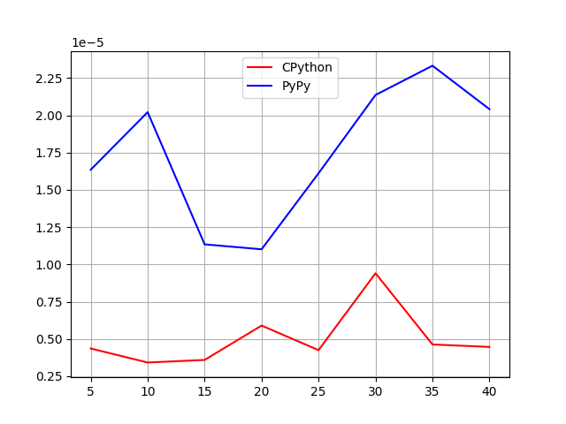
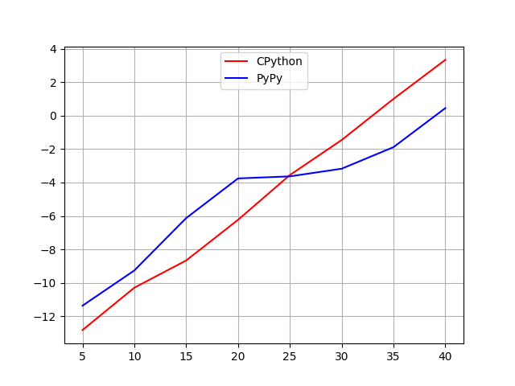

# PyPy and CPython Benchmark

### pypy-and-cpython-benchmark.sh

Job script. It helps us to run the scripts faster.

### data.txt

This file contains all the data collect from the experiments, but in "raw" format.

### data_formated.txt

The same but -h (Human Readable).

### *.py

data-analizer is the one that make the interpreter comparison.

others *.py are experiments

# Results

### Fibonacci

#### Iterative

 
CPython was faster in this case but they are similar (T ~ 10⁻⁶)

(Using Logarithm scales)

In the begging, CPython was faster but PyPy became faster. 

# Conclusion

PyPy takes a lot of time to start working, but in long live program that has no C extesions beeing used, PyPy become faster because of its JIT (Just-in-Time Compiler) that find out hotspots in a program.

